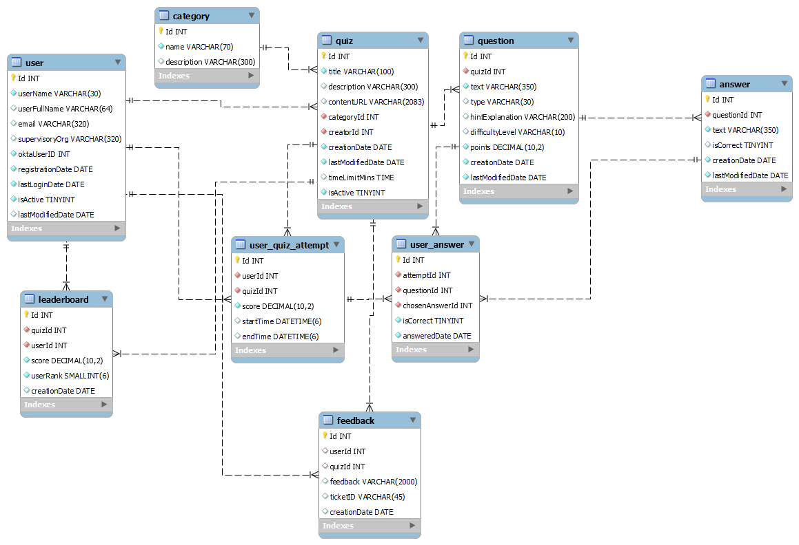
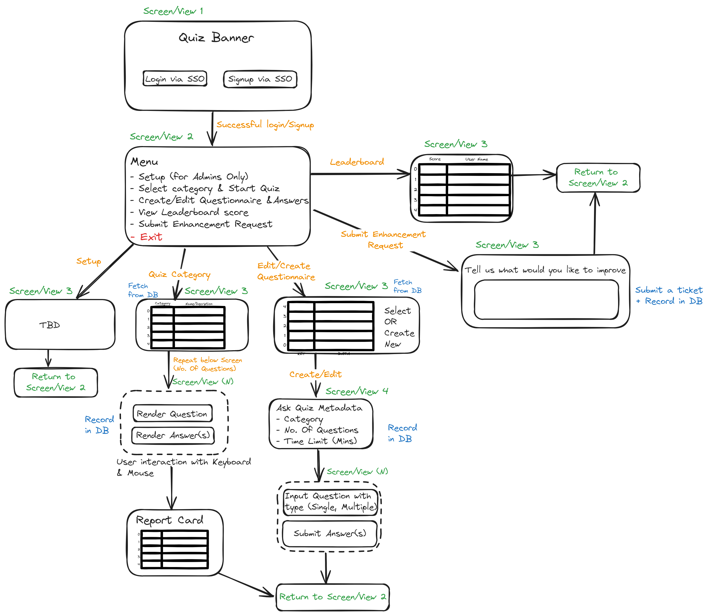

# Lets Quiz!


## Description

`LetsQuiz` is a quiz platform built as a Text User Interface (TUI) application in Go, utilizing the Bubble Tea framework, which is inspired by the Elm Architecture. It combines Go's efficiency and scalability to deliver a robust and responsive user experience.

## Table of Contents

- [Getting Started](#getting-started)
- [Installation](#installation)
- [Usage](#usage)
- [Contributing](#contributing)
- [License](#license)
- [Authors and Acknowledgment](#authors-and-acknowledgment)
- [Project Status](#project-status)

## Getting Started

To make it easy for you to get started with GitLab, here's a list of recommended next steps.

### Add your files

- [ ] [Create](https://docs.gitlab.com/ee/user/project/repository/web_editor.html#create-a-file) or [upload](https://docs.gitlab.com/ee/user/project/repository/web_editor.html#upload-a-file) files
- [ ] [Add files using the command line](https://docs.gitlab.com/ee/gitlab-basics/add-file.html#add-a-file-using-the-command-line) or push an existing Git repository with the following command:

```sh
cd existing_repo
git remote add origin https://github.com/niel-biswas/letsquiz.git
git branch -M master
git push -uf origin master
```
## Installation

To install the project, follow these steps:
```sh
git clone https://github.com/niel-biswas/letsquiz.git
cd letsquiz
go mod tidy
go build
```

## Database ERD




## Application Flow




## Usage

To run the project, use the following command:
```sh
sh
./letsquiz
```

## Contributing

Please refer to the contribution guidelines for more details.

## License

This project is licensed under the GNU General Public License v3.0 - see the [LICENSE](./LICENSE) file for details.

## Authors and Acknowledgment

- Author: niel-biswas

## Project Status

This project is currently in active development. Contributions are welcome!
